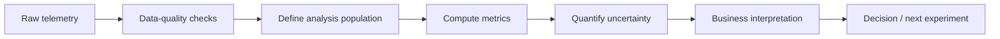
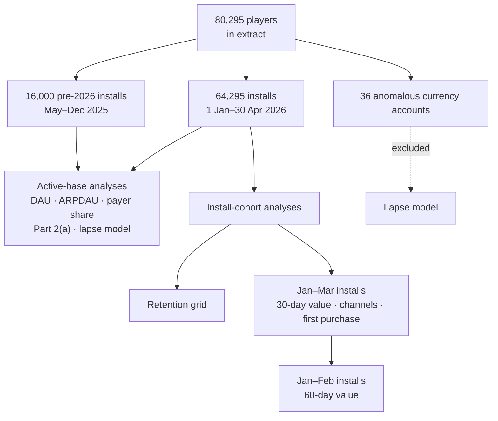
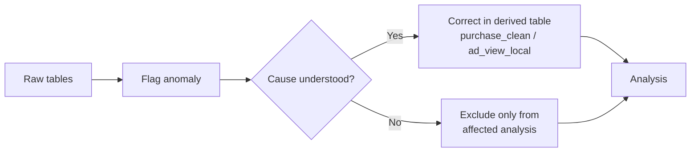
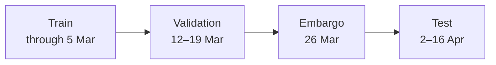
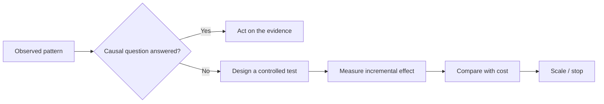

# Assumptions & Limitations

> **Analysis contract for the live-service game telemetry project**  
> Definitions, analysis populations, data-quality handling, judgement calls, and the limits of what the supplied telemetry can support.

**Consistency:** Every number in this document comes from the executed SQL files and notebooks and is intended to match the `README.md` and final readout deck.

---

## 1. At a glance

| Item | Definition |
|---|---|
| **Study window** | 1 Jan – 30 Apr 2026 |
| **Players** | 80,295 |
| **Active player-days** | ~667K |
| **Revenue scope** | In-app purchases only |
| **Primary units** | Player · player-day · purchase/event |
| **Analysis areas** | Game health · retention · monetization · acquisition · lapse risk |

### Evidence pipeline

> **Principle:** observed patterns are separated from causal claims.  
> Cleaning is documented in derived tables / analysis logic; raw tables are not silently overwritten.

---

## 2. Core definitions

### Revenue & monetization

| Metric | Definition |
|---|---|
| **Revenue** | In-app purchase revenue (`purchase.usd_amount`) only. Ad revenue is not in the extract. `reward_amount` is in-game currency given away, not revenue. |
| **Gross revenue** | Positive rows of `purchase_clean` after duplicate removal and refund exclusion, dated by purchase date. **$217,593.22**. Used for ARPDAU and per-player work. |
| **Net revenue** | Gross + refunds = **$214,343.48**. Reported in totals only because refunds can arrive days after the purchase they reverse. |
| **ARPDAU** | Gross revenue ÷ active player-days. For a period: total revenue ÷ total player-days, never an average of daily ratios. |
| **Value per install** | Gross IAP generated in the first 30 or 60 days after install, divided by installs in the eligible cohort. |

### Players, activity & retention

| Term | Definition |
|---|---|
| **Active player-day / DAU** | One row in `player_day`. |
| **Daily payer share** | Buyers who were also active that day ÷ DAU. |
| **Retention Dn** | Share of an install cohort active on exactly install date + *n*. Reported player-weighted using only cohorts that have fully reached day *n*. |
| **Country tier** | `country_tier` from the profile; Tier 1 = highest revenue potential. |
| **14-day lapse** | Active at least once in the 7 days up to a weekly snapshot, then no recorded activity in the following 14 days. |

---

## 3. Analysis populations

Different questions require different eligible populations. The same player can therefore appear in one analysis and be excluded from another.

### Population map

| Population | Size | Used in | Excluded from |
|---|---:|---|---|
| All players | 80,295 | DAU, ARPDAU, payer share, Part 2(a) | — |
| Pre-2026 installs | 16,000 | Active-base metrics, lapse model | Retention, channels, value per install, first purchase |
| 2026 installs | 64,295 | Retention | — |
| Jan–Mar installs | 37,489 | 30-day value, channel comparison | — |
| Jan–Feb installs | 19,280 | 60-day value | — |
| Anomalous currency accounts | 36 | IAP metrics | Lapse model |

### Why pre-2026 players remain in the active base

The 16,000 players installed before January 2026 are valid members of the active player base, so they remain in **DAU, ARPDAU, payer-share, and lapse analyses**.

They are excluded from analyses anchored on install date because only the players still visible in the 2026 extract are observed — effectively a survivor population.

---

## 4. Time windows

| Window | Dates | Used for |
|---|---|---|
| **First 30 days** | 1–30 Jan 2026 | Part 2(a) “before” |
| **Last 30 days** | 1–30 Apr 2026 | Part 2(a) “after” |
| **30-day value cohort** | Installs 1 Jan – 31 Mar | Value per install, channels |
| **60-day value cohort** | Installs 1 Jan – 28 Feb | 60-day value |
| **Sale-cycle screen** | 7 full cycles, 8 Jan – 22 Apr | Part 2(b) |
| **Lapse model** | Weekly snapshots, 29 Jan – 16 Apr | Part 4(a) |

> Both ARPDAU comparison windows contain **4 sale days**, so the promotion calendar does not drive the before/after comparison.

---

## 5. Data-quality decisions

### Quality-control summary

| Issue | Evidence | Treatment |
|---|---|---|
| **`ad_view` timestamps shifted by 8 hours** | Ad events span 14:00–07:59 with none 08:00–13:59, while other tables span 06:00–23:59. Raw: 51% of ad player-days have no activity row; shifted −8h: 0%. Raw: 8,212 player-days change cap mid-day; shifted: 0. | All ad analysis uses `ad_view_local`. The 7,732 raw 1 May events are treated as 30 Apr events and retained. |
| **Ad data missing 5–6 March** | No ad rows while activity, purchases and currency spends continue normally. | Treated as a logging gap: excluded from ad trends, not counted as zero. |
| **Duplicate purchases** | 122 `purchase_id`s appear twice with the same device, pack and amount. | First occurrence kept in `purchase_clean` (−$1,815.82). |
| **Refunds** | 226 negative rows after de-duplication, totalling **−$3,249.74**; 222 match an earlier purchase of the same pack by the same player. | Excluded from gross revenue; included in net. |
| **Pre-2026 players are survivors** | 16,000 players installed May–Dec 2025; 99.4% are active in 2026. | Excluded from install-based analysis. |
| **Purchases with no activity row** | 2,449 of 15,078 gross purchases (16.2%). Share is flat across hours and tiers. | Revenue retained. Daily payer share counts only buyers active that day. |
| **Purchases before `install_date`** | 111 purchases by 110 players, a few days before install. | Players kept; first-purchase timing clipped to day 0. |
| **`original_device_id` links** | 3,211 links: 94% cross countries, 42% cross platforms. | Not used; each `device_id` is one player. |
| **Anomalous currency spends** | 36 accounts spend up to **75.8M** in one event, while balances remain below ~17K. | Excluded from the lapse model; no effect on IAP revenue. |
| **Refund rows retain `sale_flag`** | Refunds can retain `sale_flag = 1` on non-sale days. | Sale days identified from positive purchases only. |
| **Late first activity** | Only ~65% of new installs are active on install date. | Retention remains anchored on `install_date`; D1 is interpreted accordingly. |
| **Empty CSV fields** | Plain `LOAD DATA` can turn empty fields into `0` / `0000-00-00`. | `setup.sql` loads empty fields as `NULL`. |

### Cleaning rule

> **Raw tables are never overwritten.** Cleaning lives in derived tables or analysis code.

---

## 6. Analytical judgement calls

| Decision | Choice | Why |
|---|---|---|
| **Part 2 question** | 2(a) in full; 2(b) screened only | 2(a) links directly to the year's goal and the brief's install-mix warning. 2(b) is screened at the end of `02_deep_dive.ipynb` and on slide 7. |
| **Unit for ARPDAU** | Country tier, not country | As directed by the brief. |
| **ARPDAU uncertainty** | Player-level Poisson bootstrap, 1,000 draws | Daily ARPDAU follows the 15-day sale cycle, so days are not independent observations. |
| **Channel comparison** | Direct standardisation to pooled tier mix + stratified player bootstrap, 5,000 draws | Adding install month as a second stratum gives almost the same result. |
| **Multiple comparisons** | Holm correction across 3 D7 channel pairs | Organic vs Paid Video: p = 0.028 raw, 0.083 after Holm. |
| **Lapse window** | 14 days | 89% of gaps between play days are ≤14 days; 79% of players return even after 28 silent days. |
| **Snapshots** | Weekly, not daily | Limits near-duplicate rows for highly active players. |
| **Model validation** | Time split with one-week embargo | Prevents training labels from overlapping the test period. |
| **Model choice** | Interpretable logistic regression | Alternative specification adds only ~0.01 AUC but includes level/tenure variables with correlation ≈0.88 and unstable coefficient signs. |
| **Sale-cycle baseline** | Mean ARPDAU on cycle days 5–10 | Furthest from any sale; the resulting offset is therefore treated as a screen, not causal evidence. |
| **Part 4(b)** | Not attempted | Only installs up to ~30 January have a full 90-day window, and those installs predate the paid ramp. |

### Lapse-model split

---

## 7. What the data supports

| Finding supported by the extract | Evidence |
|---|---|
| **ARPDAU movement is largely a mix signal** | Country-tier mix shifted sharply toward Tier 4 while within-tier change was not distinguishable from zero. |
| **Tier-level 30/60-day IAP value can be estimated** | Complete install cohorts support observed value-per-install calculations. |
| **Channel value differences are small after tier matching** | Standardised channel comparisons remove most of the raw revenue gap. |
| **Lapse risk can be ranked** | Logistic regression generalizes to later unseen weeks. |
| **Ad caps are rarely reached** | Cap-hit shares are very low under observed telemetry. |
| **Revenue is concentrated around sale days** | Sale-day revenue is elevated, with nearby days contributing to the observed pattern. |

---

## 8. What the data cannot establish

| Business question | Missing evidence |
|---|---|
| **Why did the player mix change?** | Marketing-spend detail, campaign-level attribution, and acquisition context. |
| **Which tier is profitable to acquire?** | CPI / CAC and net revenue after platform fees. |
| **Does one acquisition channel cause better value?** | Randomised acquisition evidence or stronger causal attribution. |
| **How many lapses can an offer prevent?** | Randomised offer holdout / uplift experiment. |
| **Would raising the ad cap increase value?** | Known cap assignment plus a controlled cap experiment. |
| **Do sales create incremental revenue?** | Controlled experiment or cadence variation. |
| **What is lifetime value beyond 60 days?** | Longer observation window. |

---

## 9. Specific limitations

### 9.1 Gross vs net value

The reported IAP value is **gross of app-store fees**.

For example, the observed Tier-4 60-day value of approximately **$1.63 gross** corresponds to roughly **$1.14–$1.39 net** under a 30%–15% illustrative store-fee range.

### 9.2 Ad revenue is absent

Ad revenue is not present in the extract.

This matters because Tier 4 players generate substantially more rewarded-ad activity than Tier 1 players, so IAP-only value may understate their full monetization value.

### 9.3 No lifetime extrapolation

The extract does not support a defensible LTV estimate beyond the observed 60-day horizon. No long-term value is extrapolated.

### 9.4 60-day value comes from an earlier cohort

The 60-day value estimate uses **Jan–Feb 2026 installs**, which are largely pre-ramp.

Applying this benchmark to later Paid Video installs should therefore be treated as a **directional reference**, not a direct estimate of later-cohort lifetime value. The channel analysis provides supporting evidence that observed channel differences shrink after country-tier matching.

### 9.5 Churn-risk value is an upper bound

The **$0.62** lapse-value figure is the observed 30-day IAP gap between players who stayed and those who lapsed in the highest-risk fifth.

It is **not causal uplift**. Players who stay are more engaged to begin with.

### 9.6 Ad-cap assignment is unknown

The cap-5 vs cap-8 comparison assumes caps are not systematically assigned to different player types or days.

Therefore, the observed cap-headroom result does **not** establish the impact of changing the cap.

### 9.7 Sale-offset estimate is a screen

The sale offset depends on the assumed “normal” period and ranges **51–104% across the 7 cycles**.

A controlled **15-day vs 30-day cadence test** is required to establish whether sales create incremental revenue or primarily move purchases in time.

---

## 10. From observation to decision

### Interpretation guardrail

> **The telemetry is strong enough to prioritize questions, but not every observed difference is a causal business effect.**

**Measure → adjust for composition → quantify uncertainty → test causality before scaling.**

---

## Repository references

| Artifact | Purpose |
|---|---|
| `README.md` | Executive project overview and key findings |
| `sql/` | Data-quality checks and core SQL analysis |
| `notebooks/` | Exploratory, deep-dive, channel, and lapse analyses |
| `readout/` | Final manager-facing presentation |
| `ASSUMPTIONS_AND_LIMITATIONS.md` | Detailed definitions, population rules, data-quality decisions, and limitations |
