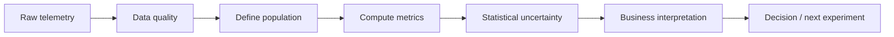
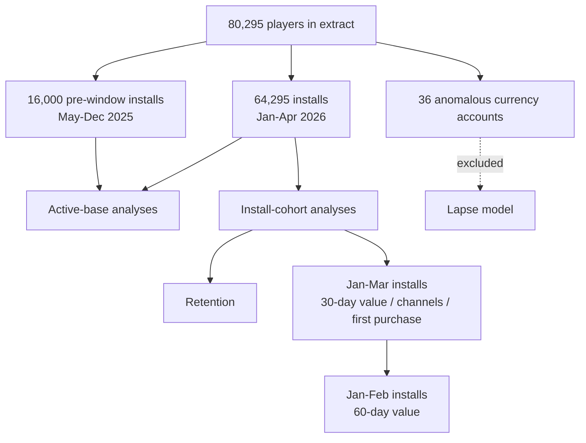
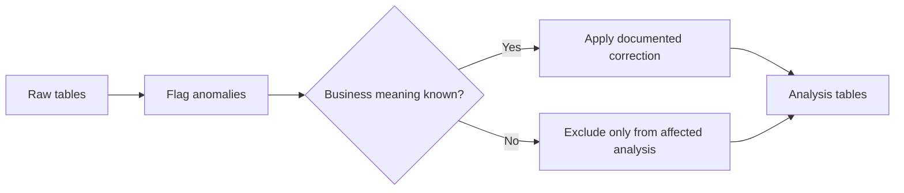

# Assumptions & Limitations

This document records the **definitions, analysis populations, data-quality decisions, judgement calls, and limitations** behind the live-service game analysis.

> **Principle:** every reported number comes from the executed SQL files and notebooks.  
> Raw telemetry is preserved; handling decisions are documented rather than hidden.

---

## Contents

- [1. Analysis at a glance](#1-analysis-at-a-glance)
- [2. Core definitions](#2-core-definitions)
- [3. Analysis populations](#3-analysis-populations)
- [4. Data-quality decisions](#4-data-quality-decisions)
- [5. Analytical judgement calls](#5-analytical-judgement-calls)
- [6. What the data supports](#6-what-the-data-supports)
- [7. What the data cannot establish](#7-what-the-data-cannot-establish)
- [8. Important limitations](#8-important-limitations)

---

## 1. Analysis at a glance

| Item | Definition |
|---|---|
| **Study window** | 1 Jan – 30 Apr 2026 |
| **Players** | 80,295 |
| **Active player-days** | ~667K |
| **Revenue** | In-app purchases only |
| **Main analytical units** | Player, player-day, purchase/event |
| **Main outputs** | Game health, retention, monetization, acquisition, churn risk |

### Decision framework



The analysis deliberately separates **observed patterns** from **causal conclusions**.

---

## 2. Core definitions

### Revenue & monetization

| Metric | Definition |
|---|---|
| **Revenue** | In-app purchase revenue from `purchase.usd_amount`. Ad revenue is not in the extract. `reward_amount` is in-game currency, not revenue. |
| **Gross revenue** | Positive rows in `purchase_clean` after deduplication and excluding refunds. **$217,593.22**. |
| **Net revenue** | Gross revenue + refunds = **$214,343.48**. Reported for totals only because refunds can arrive days after the original purchase. |
| **ARPDAU** | Gross revenue ÷ active player-days. For a period, total revenue ÷ total player-days — never an average of daily ratios. |
| **Daily payer share** | Players who purchased and were active that day ÷ DAU. |
| **Value per install** | Gross IAP generated within the first 30 or 60 days after install, divided by installs in the eligible cohort. |

### Retention & churn

| Metric | Definition |
|---|---|
| **DAU / active player-day** | One row in `player_day`. |
| **D<n> retention** | Share of an install cohort active on exactly install date + *n*. |
| **14-day lapse** | Player active at least once during the 7 days leading to a weekly snapshot, followed by no activity for the next 14 days. |
| **Country tier** | `country_tier` from player profile; Tier 1 is the highest revenue-potential tier. |

### Time windows

| Window | Definition |
|---|---|
| **First 30 days** | 1–30 Jan 2026 |
| **Last 30 days** | 1–30 Apr 2026 |
| **30-day value cohort** | Installs from Jan–Mar 2026 |
| **60-day value cohort** | Installs from Jan–Feb 2026 |

> Both the first and last 30-day ARPDAU windows contain **4 sale days**.

---

## 3. Analysis populations

Different questions require different eligible populations. Using the wrong population can produce a number that looks reasonable but answers the wrong question.



### Why pre-window players stay in some analyses

The 16,000 players installed before January 2026 are valid members of the active player base. They are therefore retained in **DAU, ARPDAU, payer-share, and lapse analyses**.

They are excluded from analyses that depend on a known install date because only players still visible in the 2026 extract are observed — effectively a survivor population.

### Cohort completeness

Retention cells are shown only when the full milestone is observable. Recent cohorts therefore have `NULL` rather than being incorrectly treated as zero retention.

---

## 4. Data-quality decisions

The following issues were found in the supplied telemetry and explicitly handled.

| Issue | Evidence | Treatment |
|---|---|---|
| **Ad timestamps shifted by 8 hours** | Raw ad dates created large same-day mismatches and cap inconsistencies; shifting by −8h removes those issues. | Ad analysis uses `ad_view_local`. Events appearing on 1 May are retained as 30 Apr local-time events. |
| **5–6 Mar ad telemetry gap** | No ad rows while player activity, purchases, and currency spends continued normally. | Treated as missing telemetry, not zero engagement. |
| **Duplicate purchases** | 122 `purchase_id` values appear twice with matching device, pack, and amount. | First occurrence retained in `purchase_clean`. |
| **Refunds** | 226 negative purchase rows after deduplication, totalling **−$3,249.74**. | Excluded from gross revenue; included in net revenue. |
| **Purchases with no activity row** | 2,449 of 15,078 gross purchases (16.2%) occur on days without a `player_day` row. | Revenue retained. Daily payer share counts only buyers active that day. |
| **Purchases before install date** | 111 purchases across 110 players. | Players retained; first-purchase timing is clipped to day 0. |
| **`original_device_id` links** | 3,211 links; 94% cross-country and 42% cross-platform. | Not used for identity stitching. `device_id` remains the player key. |
| **Extreme currency spends** | 36 accounts show events up to **75.8M**, while balances remain below ~17K. | Excluded from lapse modelling; no impact on IAP revenue. |
| **`sale_flag` on refunds** | Refund rows can retain the original sale flag even after the sale day. | Sale days identified using positive purchases only. |
| **Late first activity** | Only ~65% of new installs are active on install day; some first appear 1–14 days later. | Retention remains anchored to install date, with D1 interpreted accordingly. |
| **Empty CSV fields** | MySQL `LOAD DATA` can convert empty fields into `0` / `0000-00-00`. | `setup.sql` loads empty fields as `NULL`. |

### Data-quality rule



Raw data is not silently overwritten. Cleaning is performed in derived tables or analysis logic.

---

## 5. Analytical judgement calls

### Monetization deep dive

**Part 2(a) was selected over 2(b).**

Part 2(a) directly connects to the goal of increasing revenue without increasing marketing spend and to the brief's warning about changing install mix. Part 2(b) is screened separately in the appendix.

### Country tier rather than country

Tier is used as the main unit for ARPDAU because the brief explicitly directs the analysis toward country-tier effects.

### ARPDAU uncertainty

Daily revenue follows a strong sale cadence, so daily observations are not treated as independent.

The uncertainty analysis therefore uses **player-level Poisson bootstrap** for player comparisons and **moving block bootstrap** for the time-series ARPDAU deep dive.

### Acquisition channels

Channels are compared at a common country-tier mix using direct standardization.

Adding install month as an additional stratum produces a very similar result.

### 14-day lapse definition

The 14-day window is supported by the observed spacing of activity:

- **89%** of gaps between play days are ≤14 days.
- **79%** of players return even after 28 silent days.

A longer definition would delay the signal without producing a clearly cleaner "gone" state.

### Churn model design

Weekly snapshots are used to avoid creating many near-duplicate rows for highly active players.

The split is time-based:

```text
Train      → through 5 Mar
Validation → 12–19 Mar
Embargo    → 26 Mar
Test       → 2–16 Apr
```

The embargo prevents training labels from overlapping the later test period.

### Model choice

The interpretable logistic model was selected. An alternative specification improved AUC by only about **0.01**, but included highly correlated level/tenure variables (correlation ≈ **0.88**) and produced unstable coefficient signs.

### Part 4(b)

90-day analysis was not attempted because only installs up to approximately 30 January have a complete 90-day observation window, and those installs substantially predate the paid ramp.

---

## 6. What the data supports

| Finding supported by the extract | Evidence |
|---|---|
| **ARPDAU movement is largely a mix signal** | Country-tier mix shifted sharply toward Tier 4 while within-tier change was not distinguishable from zero. |
| **Tier-level 30/60-day IAP value can be estimated** | Complete install cohorts allow observed value-per-install calculations. |
| **Channel value differences are small after tier matching** | Standardized channel comparisons remove most of the raw revenue gap. |
| **Lapse risk can be ranked** | Logistic regression generalizes to later, unseen weeks. |
| **Ad caps are rarely reached** | Cap-hit shares are very low under the observed telemetry. |
| **Revenue is concentrated around sale days** | Sale-day revenue is elevated, with nearby days contributing to the observed pattern. |

---

## 7. What the data cannot establish

| Question | Missing evidence |
|---|---|
| **Why did the player mix change?** | Marketing-spend detail, campaign-level attribution, and acquisition context. |
| **Which tier is profitable to acquire?** | CPI / CAC and net revenue after platform fees. |
| **Does one acquisition channel cause better value?** | Randomized acquisition evidence or stronger causal attribution. |
| **How many lapses can an offer prevent?** | Randomized offer holdout / uplift experiment. |
| **Would raising the ad cap increase value?** | Known cap assignment plus a controlled cap experiment. |
| **Do sales create incremental revenue?** | A controlled experiment or cadence variation. |
| **What is lifetime value beyond 60 days?** | Longer observation window. |

---

## 8. Important limitations

### 8.1 Gross vs net value

The reported IAP value is **gross of app-store fees**.

For example, the observed Tier-4 60-day value of approximately **$1.63 gross** corresponds to roughly **$1.14–$1.39 net** under a 30%–15% store-fee range.

### 8.2 Ad revenue is absent

Ad revenue is not present in the extract.

This matters because Tier 4 players generate substantially more rewarded-ad activity than Tier 1 players, so IAP-only value may understate their full monetization value.

### 8.3 No lifetime extrapolation

The extract does not support a defensible LTV estimate beyond the observed 60-day horizon. No long-term value is extrapolated.

### 8.4 60-day value is from an earlier cohort

The 60-day value estimate uses **Jan–Feb 2026 installs**, which are largely pre-ramp.

Applying that benchmark to later Paid Video installs relies on the separate finding that channel differences largely disappear after matching on country tier.

### 8.5 Churn-risk value is an upper bound

The **$0.62** lapse-value figure is the observed 30-day IAP gap between players who stayed and those who lapsed in the highest-risk fifth.

It is **not causal uplift**. Players who stay are more engaged to begin with.

### 8.6 Ad-cap assignment is unknown

The cap-5 vs cap-8 comparison assumes caps are not systematically assigned to different player types or days.

Therefore, the observed cap-headroom result does not establish the impact of changing the cap.

---

## Bottom line

> **The telemetry is strong enough to prioritize questions, but not every observed difference is a causal business effect.**

The analysis therefore uses a simple rule:

**Measure → adjust for composition → quantify uncertainty → test causality before scaling.**
