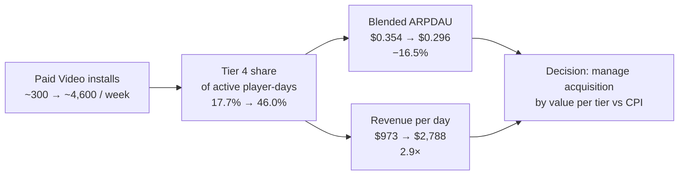
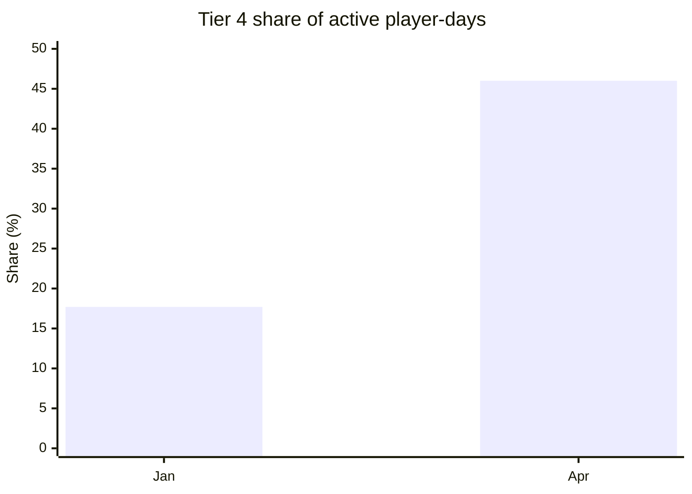
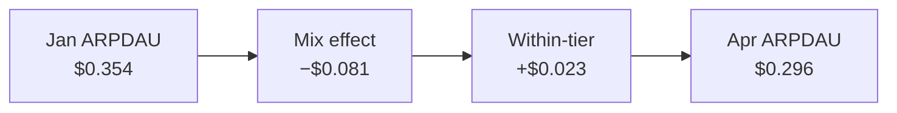
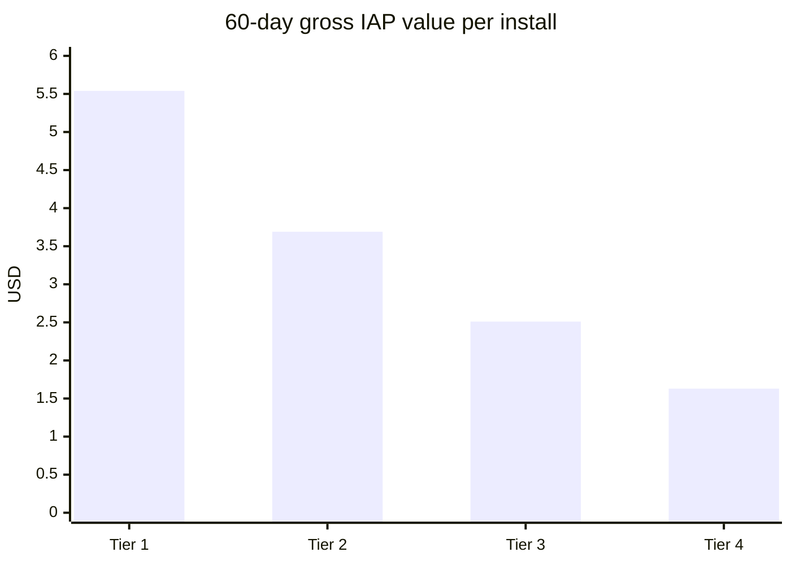
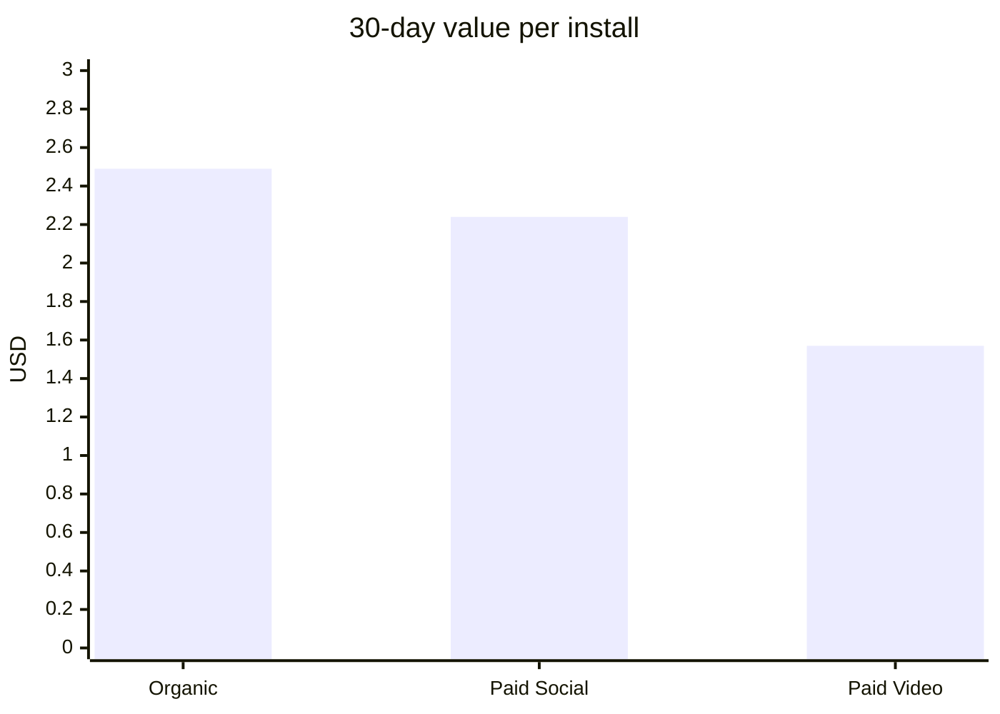
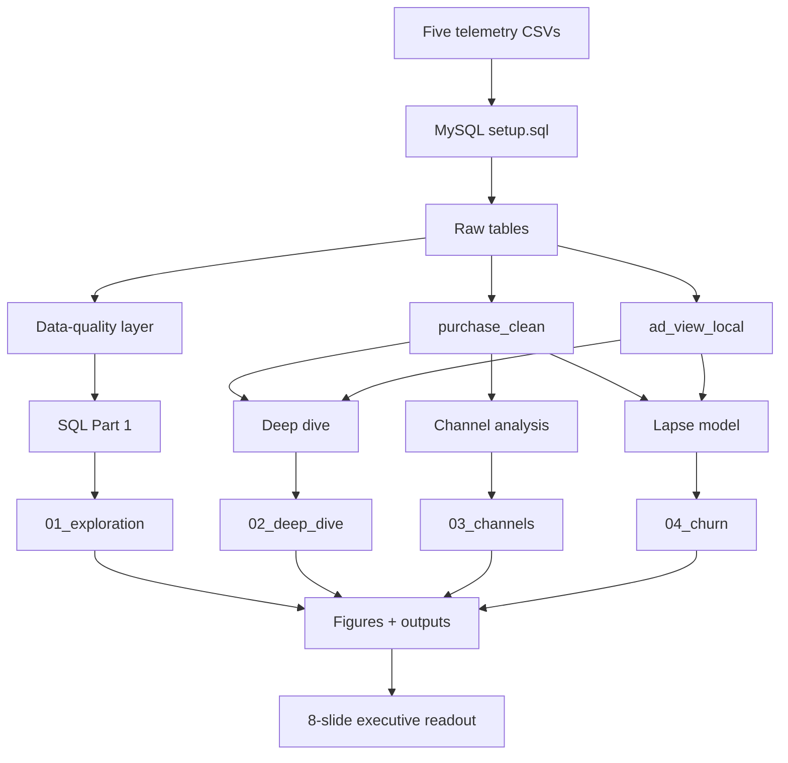
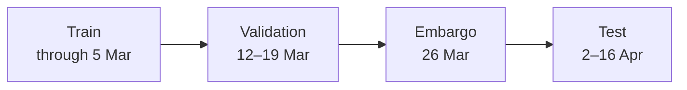

# Player Telemetry Review
### Live-Service Mobile Game Analytics · SQL + Python + Statistics

> A four-month analysis of player health, monetization mix, acquisition quality, rewarded-ad engagement, sales cadence, and 14-day lapse risk.

**Study window:** 1 Jan – 30 Apr 2026 · **80,295 players** · **667,435 active player-days** · **5 source tables**

[Executive Readout](readout/Analyst_Take_Home_Readout.pptx) · [Assumptions & Limitations](ASSUMPTIONS_AND_LIMITATIONS.md) · [SQL](sql/) · [Notebooks](notebooks/)

---

## Executive Summary

### The story in one picture



### Business takeaway

**The player base expanded materially while blended ARPDAU fell. The main signal is composition, not broad within-tier deterioration.** The practical planning question is therefore **what each acquired player is worth by country tier versus what that install costs**.

---

## KPI Snapshot

| Area | Metric | Result |
|---|---|---:|
| **Growth** | DAU, Jan 1 → Apr 30 | **1,789 → 11,097** |
| **Revenue** | Revenue per day | **$973 → $2,788** |
| **Monetization** | ARPDAU | **$0.354 → $0.296** |
| **Retention** | D1 / D7 / D30 | **47.6% / 25.4% / 13.9%** |
| **Acquisition** | Paid Video weekly installs | **~300 → ~4,600** |
| **Lapse model** | Top-10% precision | **46.9%** |

---

# 1. Key Findings

## 1.1 Game health: growth without a broad retention collapse

| Metric | Result |
|---|---:|
| DAU growth | **6×** · 1,789 → 11,097 |
| D1 retention | **47.6%** |
| D7 retention | **25.4%** |
| D14 retention | **19.5%** |
| D30 retention | **13.9%** |

**Interpretation:** the active base expanded quickly, while mature cohort retention remained broadly stable.

---

## 1.2 ARPDAU: the mix changed more than the tiers

### January vs April

| Country tier | Player-day share · Jan | Player-day share · Apr | ARPDAU · Jan | ARPDAU · Apr |
|---|---:|---:|---:|---:|
| Tier 1 | 34.5% | 20.5% | $0.519 | $0.556 |
| Tier 2 | 26.1% | 15.6% | $0.374 | $0.403 |
| Tier 3 | 21.8% | 18.0% | $0.234 | $0.261 |
| **Tier 4** | **17.7%** | **46.0%** | **$0.154** | **$0.158** |
| **All players** | **100%** | **100%** | **$0.354** | **$0.296** |



### Symmetric decomposition



The within-tier change has a 95% bootstrap interval of **−$0.006 to +$0.053**. Both the first and last 30-day windows contain **4 sale days**.

**Read:** the aggregate decline should be interpreted alongside player mix rather than as evidence of a broad monetization deterioration.

---

## 1.3 Value per install: Tier 1 is worth substantially more than Tier 4

**Gross IAP value per install**

| Country tier | 30-day value | 60-day value |
|---|---:|---:|
| Tier 1 | $3.53 | **$5.54** |
| Tier 2 | $2.29 | **$3.69** |
| Tier 3 | $1.75 | **$2.51** |
| Tier 4 | $1.10 | **$1.63** |



The **$1.63 Tier-4 value is a gross IAP benchmark, not a break-even CPI**. After an illustrative 15–30% store fee, the corresponding value is roughly **$1.14–$1.39**. Ad revenue and value beyond 60 days are not in the extract.

---

## 1.4 Acquisition channels: raw differences shrink after matching player mix

Paid Video is heavily concentrated in Tier 4:

- **Paid Video:** ~65% Tier 4
- **Organic:** ~18% Tier 4
- **Paid Social:** ~18% Tier 4

| Channel | Raw 30-day value / install | Matched tier mix |
|---|---:|---:|
| Organic | $2.49 | **$2.17** |
| Paid Social | $2.24 | **$1.98** |
| Paid Video | $1.57 | **$2.07** |



After tier standardization, the Organic–Paid Video gap is approximately **$0.11/install**, with a **95% CI of −$0.21 to +$0.41**.

The strongest D7 comparison is **+1.35 percentage points** for Organic vs Paid Video, but it does not survive Holm correction. This is a **composition-adjusted observational comparison, not causal evidence of channel effectiveness**.

---

## 1.5 Lapse risk: useful ranking, not proof of offer uplift

| Test metric | Result |
|---|---:|
| ROC-AUC | **0.74** |
| PR-AUC | **0.39** |
| Base lapse rate | **~19%** |
| Precision in top 10% | **46.9%** |
| Lift in top 10% | **2.5×** |
| Lapsers returning within 30 days | **84.5%** |
| Highest-risk fifth: observed 30-day IAP gap | **≤ $0.62** |

The model is a **risk-ranking tool**. It does not estimate treatment uplift. A comeback-offer holdout is required before rollout.

---

## 1.6 Rewarded ads and sale cadence

### Rewarded ads

| Observation | Result |
|---|---:|
| Cap-5 hit share | **1.27%** |
| Cap-8 hit share | **0.02%** |
| Average interactions/day | **~1.65** under both caps |

The current telemetry does not show strong cap pressure. **Cap assignment still needs confirmation before treating the comparison as causal.**

### Sales

Across **7 full 15-day sale cycles**, sale-day revenue is elevated, but nearby quiet days offset much of the increase.

- Observed offset: **~78%**
- Range across cycles: **51–104%**

This is a **screening result, not a causal estimate**. A 15-day vs 30-day cadence experiment is the clean next test.

---

# 2. Project Structure

```text
EA-Analyst-Take-Home/
│
├── data/                                  # supplied telemetry inputs
│   ├── player_profile.csv
│   ├── player_day.csv
│   ├── purchase.csv
│   ├── currency_spend.csv
│   └── ad_view.csv
│
├── sql/                                   # MySQL analysis layer
│   ├── setup.sql                           # database + clean analysis tables
│   ├── 01_data_quality.sql                 # telemetry checks
│   ├── 02_daily_health.sql                 # DAU, revenue, ARPDAU, payer share
│   ├── 03_retention.sql                    # D1 / D7 / D14 / D30
│   ├── 04_spender_behaviour.sql            # concentration + purchase timing
│   └── 05_ad_engagement.sql                # ad caps + engagement
│
├── notebooks/                             # statistical analysis + modelling
│   ├── db.py                               # shared MySQL runner
│   ├── style.py                            # common chart style
│   ├── 01_exploration.ipynb                # Part 1
│   ├── 02_deep_dive.ipynb                  # Part 2
│   ├── 03_channels.ipynb                   # Part 3
│   └── 04_churn.ipynb                      # Part 4
│
├── readout/
│   ├── Analyst_Take_Home_Readout.pptx      # final 8-slide executive readout
│   └── figures/                             # generated visuals
│
├── ASSUMPTIONS_AND_LIMITATIONS.md          # definitions + data decisions
├── README.md                                # project overview
├── requirements.txt
└── .gitignore
```

---

# 3. How the Project Fits Together



### Analysis flow

**Raw telemetry → Quality checks → Population definition → Metric calculation → Statistical uncertainty → Business interpretation → Test / decision**

---

# 4. Analysis Map

| Assignment area | Core question | SQL / Notebook | Readout |
|---|---|---|---|
| **Data quality** | What is wrong with the extract? | `01_data_quality.sql` | Slides 6, 8 |
| **1(a) Game health** | How is daily activity and monetization moving? | `02_daily_health.sql` + `01_exploration` | Slide 3 |
| **1(b) Retention** | Are cohorts getting weaker? | `03_retention.sql` + `01_exploration` | Slide 3 |
| **1(c) Spenders** | Where does revenue concentrate? | `04_spender_behaviour.sql` + `01_exploration` | Appendix |
| **1(d) Rewarded ads** | Is the ad cap constraining engagement? | `05_ad_engagement.sql` + `01_exploration` | Slides 6, 8 |
| **2(a) ARPDAU deep dive** | Why did blended ARPDAU fall? | `02_deep_dive` | Slides 2–5 |
| **2(b) Sales** | Do sales add revenue or move it in time? | `02_deep_dive` | Slides 6–7 |
| **3. Channels** | Are acquisition channels different after mix adjustment? | `03_channels` | Slides 5, 7 |
| **4(a) Lapse** | Can near-term lapse risk be ranked? | `04_churn` | Slides 7–8 |
| **4(b)** | Can 90-day value be estimated? | Not attempted | — |

---

# 5. Statistical Methods

| Method | Purpose |
|---|---|
| **Symmetric mix / within-tier decomposition** | Separate composition movement from within-tier ARPDAU movement |
| **Player-level Poisson bootstrap (1,000 draws)** | Uncertainty for player-level decomposition; resamples players rather than days |
| **Moving block bootstrap** | Account for serial dependence in daily ARPDAU |
| **Direct standardization** | Compare acquisition channels at a common country-tier mix |
| **Stratified player bootstrap (5,000 draws)** | Confidence intervals for channel differences |
| **Holm correction** | Control family-wise error across the three D7 channel comparisons |
| **Minimum detectable effect** | Quantify channel differences that the sample can realistically detect |
| **Logistic regression** | Rank 14-day lapse risk on later unseen data |
| **Time-based split + embargo** | Prevent temporal leakage in the lapse model |
| **Sale-cycle screen** | Check whether sale-day uplift appears to persist or shift across surrounding days |

### Lapse-model timeline



---

# 6. Data Quality: Decisions That Change the Numbers

| Issue | What was found | Treatment |
|---|---|---|
| **Ad timestamps +8h** | Same-day mismatches and cap inconsistencies | Shift `ad_view` timestamps by −8h into `ad_view_local` |
| **5–6 Mar ad gap** | No ad rows while other activity continued | Treat as missing telemetry, not zero engagement |
| **122 duplicate purchases** | Duplicate `purchase_id` values with matching transaction attributes | Keep first occurrence |
| **226 refunds after deduplication** | −$3,249.74 | Exclude from gross; include in net |
| **Pre-2026 installs** | 16,000 survivor players in 2026 extract | Exclude from install-cohort metrics; retain for active-base analyses |
| **Pre-install purchases** | 111 purchases across 110 players | Retain; clip first-purchase timing at day 0 |
| **`original_device_id`** | 94% of links cross-country | Do not stitch identities |
| **36 anomalous currency accounts** | Events up to 75.8M with much smaller balances | Exclude from lapse modelling / economy analysis; no IAP impact |
| **Empty CSV fields** | Potential MySQL import coercion | `setup.sql` loads them as `NULL` |

> Full evidence and rationale: [`ASSUMPTIONS_AND_LIMITATIONS.md`](ASSUMPTIONS_AND_LIMITATIONS.md)

---

# 7. Reproducibility

## Requirements

- MySQL 8 or MariaDB 10.6+
- Python 3.11+
- Packages in [`requirements.txt`](requirements.txt)

## Setup

```bash
# Clone the repository
 git clone <YOUR_REPOSITORY_URL>
 cd EA-Analyst-Take-Home
```

Put the five source CSVs inside `data/`, then create the database:

```bash
mysql --local-infile=1 -u root -p < sql/setup.sql
```

Create and activate the Python environment:

```bash
python -m venv .venv
```

Windows:

```cmd
.venv\Scripts\activate
```

Then:

```bash
pip install -r requirements.txt
```

Run notebooks in order:

```bash
jupyter nbconvert --to notebook --execute --inplace notebooks/01_exploration.ipynb
jupyter nbconvert --to notebook --execute --inplace notebooks/02_deep_dive.ipynb
jupyter nbconvert --to notebook --execute --inplace notebooks/03_channels.ipynb
jupyter nbconvert --to notebook --execute --inplace notebooks/04_churn.ipynb
```

The notebooks use the shared MySQL runner in `notebooks/db.py`. Database credentials are read from `MYSQL_PASSWORD` or requested interactively.

---

# 8. Scope & Status

| Area | Status |
|---|---|
| Part 1 — Game health | **Complete** |
| Part 2(a) — ARPDAU deep dive | **Complete** |
| Part 2(b) — Sales | **Screened; experiment required** |
| Part 3 — Acquisition channels | **Complete** |
| Part 4(a) — 14-day lapse risk | **Complete** |
| Part 4(b) — 90-day install value | **Not attempted** — insufficient complete 90-day coverage for the current paid ramp |

---

# 9. Key Limitations

The telemetry does **not** contain:

- marketing spend / CPI / CAC by channel and tier;
- rewarded-ad revenue;
- treatment-response data for comeback offers;
- value beyond the observed 60-day window;
- clean cap-assignment metadata;
- randomized evidence for channel, sale-cadence, or offer effects.

Therefore the analysis is strongest for **descriptive measurement, composition adjustment, risk ranking, and experiment design**. It does not claim causal channel effects, causal monetization lift, or offer uplift.

---

## Final principle

> **Measure → adjust for composition → quantify uncertainty → test causality before scaling.**

That is the decision framework used throughout the project.
