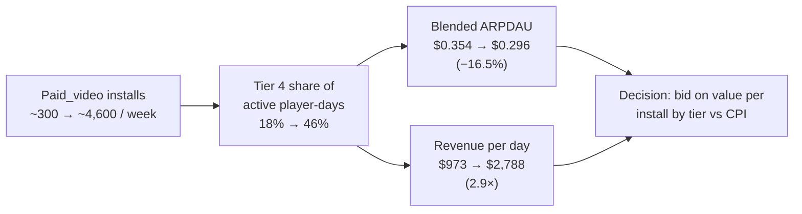
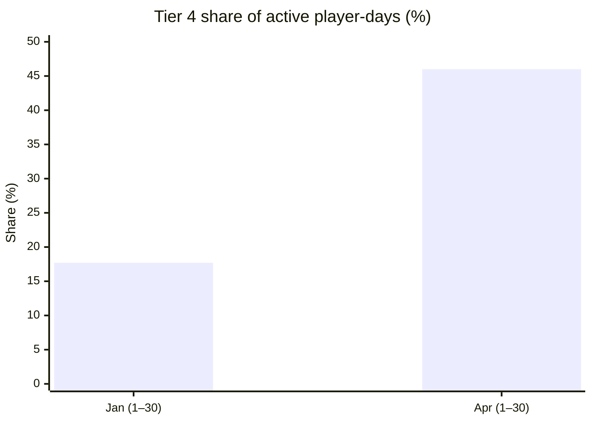
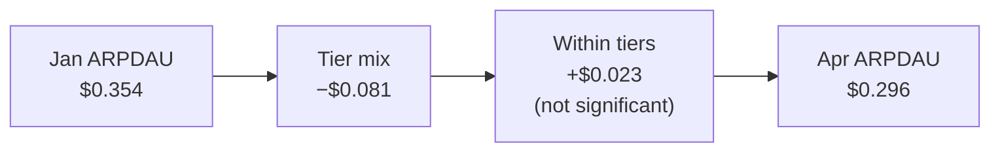
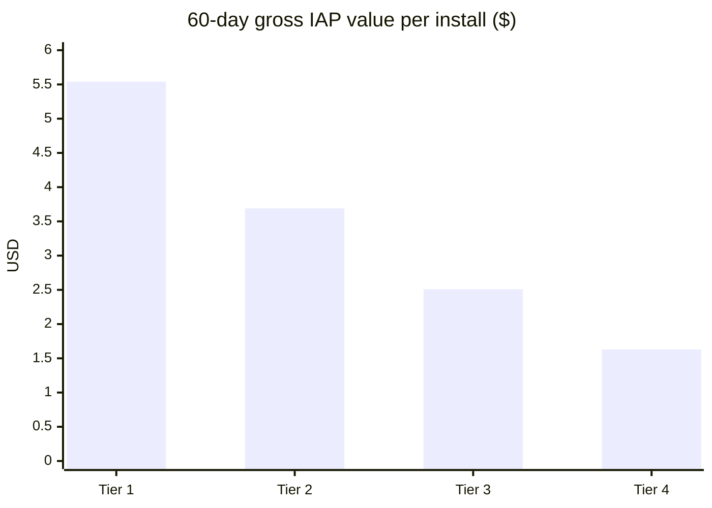
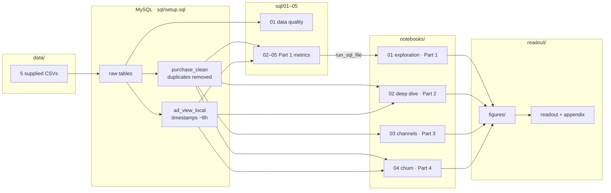
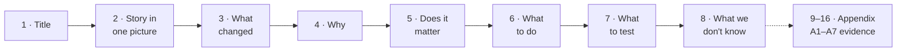
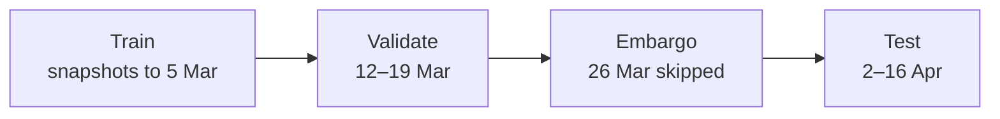
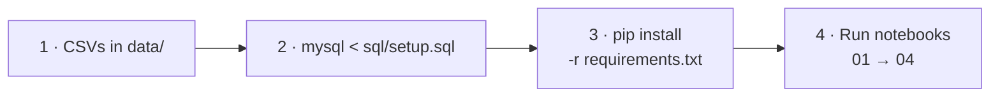

# EA Analyst Intern Take-Home: Player Telemetry Review

Analysis of four months of telemetry from a live-service mobile game, covering game health, the ARPDAU decline, acquisition channels, lapse risk, rewarded ads and sales.

| | |
|---|---|
| **Study window** | 1 Jan – 30 Apr 2026 (120 days) |
| **Scale** | 80,295 players · 667,435 active player-days · 5 source tables |
| **Stack** | MySQL 8 / MariaDB · Python (pandas, statsmodels, scikit-learn) · Jupyter |
| **Start here** | [`readout/Analyst_Take_Home_Readout.pptx`](readout/Analyst_Take_Home_Readout.pptx), an 8-slide readout for the Product Director, plus a 7-page evidence appendix (A1–A7, slides 9–16) |
| **Method detail** | [`ASSUMPTIONS_AND_LIMITATIONS.md`](ASSUMPTIONS_AND_LIMITATIONS.md) |

---

## Contents

1. [Headline](#1-headline)
2. [Key findings](#2-key-findings)
3. [Project structure](#3-project-structure)
4. [How the pieces connect](#4-how-the-pieces-connect)
5. [Analysis map](#5-analysis-map)
6. [Methods](#6-methods)
7. [Data issues that change the numbers](#7-data-issues-that-change-the-numbers)
8. [How to run](#8-how-to-run)
9. [Scope](#9-scope)

---

## 1. Headline

> **ARPDAU fell 16.5%, but revenue per day rose 2.9×.** The drop comes from player mix, not weaker monetisation. A paid_video ramp brought in mostly Tier 4 players, who spend less per day. Within each country tier, ARPDAU held flat.
>
> **So what:** stop managing to blended ARPDAU. Judge acquisition on **value per install by country tier against CPI**.



---

## 2. Key findings

| # | Question | Answer | Confidence |
|---|---|---|---|
| 1 | Is the game healthy? | DAU grew 6× (1,789 → 11,097). Retention is stable across cohorts: D1 47.6%, D7 25.4%, D14 19.5%, D30 13.9%. | High |
| 2 | Why did ARPDAU fall? | Mix. The tier mix contributes −$0.081; the within-tier change is +$0.023 (95% CI −$0.006 to +$0.053). | High |
| 3 | What is a new player worth? | 60-day gross IAP per install: Tier 1 $5.54 → Tier 4 $1.63. Tier 4 is ~$1.14–1.39 after store fees. | Medium |
| 4 | Is any channel better? | No robust difference at matched tier mix. The raw gap of $0.92 per install shrinks to $0.11 (95% CI −$0.21 to +$0.41). | Medium |
| 5 | Can lapse be predicted? | Yes, on unseen April weeks: ROC-AUC 0.74, PR-AUC 0.39 (19% base rate), top-10% precision 46.9%. But 85% of lapsers return within 30 days. | Medium |
| 6 | Is the ad cap binding? | No. 1.27% of cap-5 days and 0.02% of cap-8 days hit the cap; usage is 1.65 a day under both caps. | Medium |
| 7 | Do sales add revenue? (screened) | Not established. About 78% of the sale-day lift is offset by quieter days around it (51–104% across 7 cycles). | Low |

### 2.1 ARPDAU: the mix moved, the tiers did not

| Country tier | Share of player-days, Jan | Share of player-days, Apr | ARPDAU, Jan | ARPDAU, Apr |
|---|---:|---:|---:|---:|
| Tier 1 | 34.5% | 20.5% | $0.519 | $0.556 |
| Tier 2 | 26.1% | 15.6% | $0.374 | $0.403 |
| Tier 3 | 21.8% | 18.0% | $0.234 | $0.261 |
| **Tier 4** | **17.7%** | **46.0%** | **$0.154** | **$0.158** |
| **All players** | 100% | 100% | **$0.354** | **$0.296** |





Both windows contain 4 sale days, so the promotion calendar does not explain the change.

### 2.2 Value per install by tier (gross IAP)

| Tier | 30-day value (Jan–Mar installs) | 60-day value (Jan–Feb installs) |
|---|---:|---:|
| Tier 1 | $3.53 | $5.54 |
| Tier 2 | $2.29 | $3.69 |
| Tier 3 | $1.75 | $2.51 |
| Tier 4 | $1.10 | $1.63 |



These are value benchmarks, not break-even points. CPI is not in the data, and ad revenue is missing. Ad revenue matters because Tier 4 players complete ~1.8× as many rewarded ads per active day as Tier 1.

### 2.3 Channels: the raw gap is mostly tier mix

65% of paid_video installs are Tier 4, against about 18% for organic and paid_social.

| Channel | Raw 30-day value / install | At matched tier mix |
|---|---:|---:|
| Organic | $2.49 | $2.17 |
| Paid social | $2.24 | $1.98 |
| Paid video | $1.57 | $2.07 |

```mermaid
xychart-beta
    title "30-day value per install: raw (first bar) vs matched tier mix (second bar)"
    x-axis ["Organic", "Paid social", "Paid video"]
    y-axis "USD" 0 --> 3
    bar [2.49, 2.24, 1.57]
    bar [2.17, 1.98, 2.07]
```



- **D7 retention:** organic leads paid_video by 1.35 points (p = 0.028), but this does not survive Holm correction (p = 0.083).
- **Detection limit:** the sample can detect revenue gaps of roughly $0.36–0.45 per install (~20%). Smaller differences cannot be ruled out.

### 2.4 Lapse risk: rankable, but most lapsers come back

| Metric (test weeks 2–16 Apr) | Value |
|---|---:|
| ROC-AUC | 0.74 |
| PR-AUC (base rate 19%) | 0.39 |
| Precision in top 10% | 46.9% |
| Lift in top 10% | 2.5× |
| Lapsers who return within 30 days | 84.5% |
| Value of a prevented lapse (highest-risk fifth) | ≤ $0.62 of IAP over 30 days |

Because risk is not the same as responsiveness to an offer, comeback offers need a randomised holdout before rollout.

---

## 3. Project structure

```text
EA-Analyst-Take-Home/
│
├── data/                              the five supplied CSVs (input, not modified)
│   ├── player_profile.csv
│   ├── player_day.csv
│   ├── purchase.csv
│   ├── currency_spend.csv
│   └── ad_view.csv
│
├── sql/                               MySQL: build the database, then Part 1
│   ├── setup.sql                      create DB, load CSVs, build purchase_clean + ad_view_local
│   ├── 01_data_quality.sql            every data-quality check and how it is handled
│   ├── 02_daily_health.sql            Part 1(a)  DAU, revenue, ARPDAU, payer share
│   ├── 03_retention.sql               Part 1(b)  install-week retention grid
│   ├── 04_spender_behaviour.sql       Part 1(c)  concentration, first purchase, repeat gaps
│   └── 05_ad_engagement.sql           Part 1(d)  cap hits, daily ad volume, placements
│
├── notebooks/                         Python: checks, statistics, models, charts
│   ├── db.py                          MySQL connection + run_sql_file() runner
│   ├── style.py                       shared chart style; saves PNGs to readout/figures
│   ├── 01_exploration.ipynb           Part 1: runs sql/01–05, cross-checks, charts
│   ├── 02_deep_dive.ipynb             Part 2(a) ARPDAU decomposition + 2(b) sale-cycle screen
│   ├── 03_channels.ipynb              Part 3 channel comparison
│   └── 04_churn.ipynb                 Part 4 lapse model and offer economics
│
├── readout/
│   ├── Analyst_Take_Home_Readout.pptx 8-slide readout + appendix A1–A7
│   └── figures/                       PNGs written by the notebooks
│
├── ASSUMPTIONS_AND_LIMITATIONS.md     definitions, data handling, judgement calls, limits
├── README.md
├── requirements.txt
└── .gitignore
```

---

## 4. How the pieces connect



The notebooks run the queries in `sql/` directly through `run_sql_file()`. The Part 1 numbers in the notebooks and in the SQL therefore come from the same code.

---

## 5. Analysis map

| Brief part | Question | SQL | Notebook | Readout slide | Appendix |
|---|---|---|---|---|---|
| Data quality | What is wrong with the extract? | `01_data_quality.sql` | `01_exploration` §0 | 6, 8 | A2 |
| 1(a) | Daily health | `02_daily_health.sql` | `01_exploration` | 3 | A3 |
| 1(b) | Retention | `03_retention.sql` | `01_exploration` | 3 | A3 |
| 1(c) | Spender behaviour | `04_spender_behaviour.sql` | `01_exploration` | — | A3 |
| 1(d) | Rewarded ads | `05_ad_engagement.sql` | `01_exploration` | 6, 8 | A3 |
| 2(a) | Why did ARPDAU fall? | — | `02_deep_dive` | 2, 3, 4 | A4 |
| 2(a) | What is a new install worth? | — | `02_deep_dive` | 5 | A4 |
| 2(b) | Do sales add revenue? (screened) | — | `02_deep_dive` (end) | 6, 7 | A7 |
| 3 | Are channels different? | — | `03_channels` | 5, 7 | A5 |
| 4(a) | Can lapse be predicted? | — | `04_churn` | 7, 8 | A6 |

### Readout storyline



---

## 6. Methods

| Method | Used for | Where |
|---|---|---|
| Symmetric (Shapley) mix / within-tier decomposition | Splitting the ARPDAU change | `02_deep_dive` |
| Player-level Poisson bootstrap (1,000 draws) | Uncertainty on the decomposition. Players are resampled, not days, because daily ARPDAU follows the 15-day sale cycle. | `02_deep_dive` |
| Direct standardisation to the pooled tier mix | Comparing channels like for like | `03_channels` |
| Stratified player bootstrap (5,000 draws, channel × tier) | Channel confidence intervals | `03_channels` |
| Holm correction | D7 retention across the 3 channel pairs | `03_channels` |
| Minimum detectable effect (2.8 × SE) | What the channel test could and could not detect | `03_channels` |
| Logistic regression, weekly snapshots, time split with embargo | Ranking 14-day lapse risk | `04_churn` |
| Sale-cycle screen (7 full 15-day cycles) | Whether sales add or move revenue | `02_deep_dive` |

### Lapse model timeline



---

## 7. Data issues that change the numbers

Full evidence is in `sql/01_data_quality.sql` and [`ASSUMPTIONS_AND_LIMITATIONS.md`](ASSUMPTIONS_AND_LIMITATIONS.md#4-data-quality-decisions).

| Issue | Handling |
|---|---|
| `ad_view` timestamps are 8 hours ahead of every other table | All ad analysis uses `ad_view_local` (−8h) |
| No ad rows on 5–6 March | Treated as a logging gap, not zero engagement |
| 122 duplicated `purchase_id`s | First occurrence kept in `purchase_clean` (−$1,815.82) |
| 226 refund rows after de-duplication (−$3,249.74) | Excluded from gross revenue; included in net |
| 16,000 players installed before 2026 are survivors (99.4% active in 2026) | Excluded from retention, channel and value-per-install analysis |
| `original_device_id` links are not credible (94% cross countries) | Not used; each `device_id` is one player |
| 36 accounts with impossible currency spends | Excluded from the lapse model; no effect on IAP |

---

## 8. How to run



**1. Data.** Put the five supplied CSVs in `data/`.

**2. Database** (MySQL 8 or MariaDB 10.6+). Run from the repository root; the load paths in `setup.sql` are relative to it.

```bash
mysql --local-infile=1 -u root -p < sql/setup.sql
```

If the server refuses local files, run `SET GLOBAL local_infile = 1;` once as an admin.

**3. Python** (3.11+):

```bash
python -m venv .venv
source .venv/bin/activate        # Windows: .venv\Scripts\activate
pip install -r requirements.txt
```

**4. Notebooks**, in order. The MySQL password is read from `MYSQL_PASSWORD`, or asked for interactively.

```bash
jupyter nbconvert --to notebook --execute --inplace notebooks/01_exploration.ipynb
jupyter nbconvert --to notebook --execute --inplace notebooks/02_deep_dive.ipynb
jupyter nbconvert --to notebook --execute --inplace notebooks/03_channels.ipynb
jupyter nbconvert --to notebook --execute --inplace notebooks/04_churn.ipynb
```

Bootstraps use fixed seeds, so results reproduce exactly.

---

## 9. Scope

| Part | Status |
|---|---|
| 1 Game health (a–d) | Done |
| 2(a) ARPDAU deep dive | Done |
| 2(b) Sales | Screened only; the conclusion needs a cadence experiment |
| 3 Acquisition channels | Done |
| 4(a) Lapse risk | Done |
| 4(b) Value of a new install at 90 days | Not attempted. Only installs up to ~30 Jan have 90 days observed, and they predate the paid ramp. 30- and 60-day values are given instead. |
